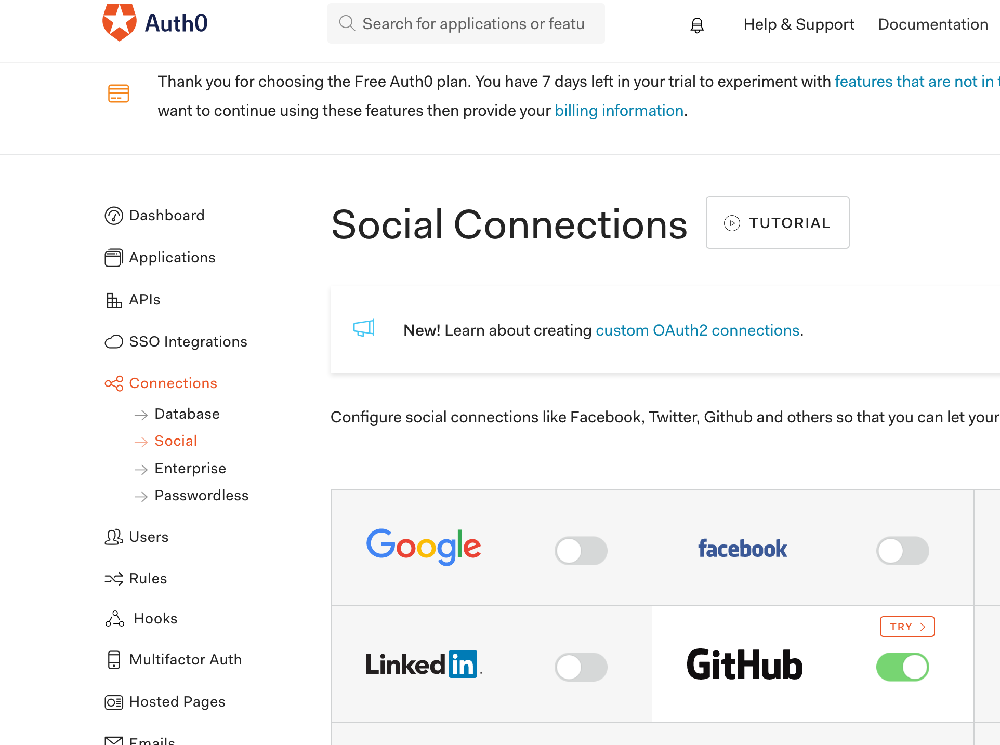
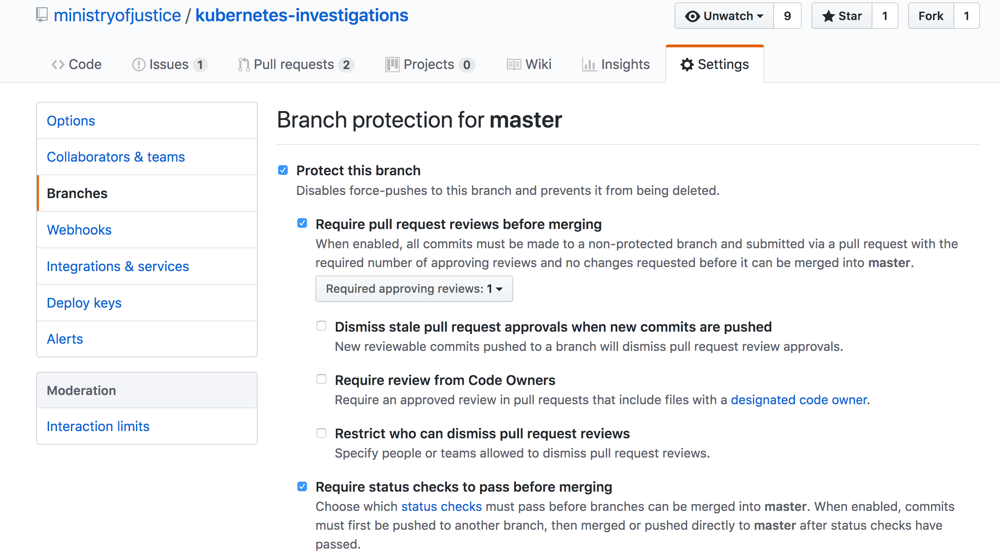

# How to create a cluster.

## Prerequisites

```
$ brew install kops
$ brew install kubernetes-cli
$ brew install kubernetes-helm
$ brew install terraform
$ git clone git@github.com:ministryofjustice/kubernetes-investigations.git
$ git clone git@github.com:ministryofjustice/cloud-platform-environments.git

- Have access to the `moj-cloud-platforms-dev` Auth0 tenant - https://manage.auth0.com
```

### Create a Kuberos application on Auth0

1. Use your Github credentials to log into https://manage.auth0.com. Switch tenant to `moj-cloud-platforms-dev`.

1. Under `Applications`, create a new single ["Regular Web App"](https://auth0.com/docs/applications/webapps). This application will be used to allow Kuberos to authenticate using Auth0. Name the application `your-cluster-name-kuberos`. Under `Settings`, take note of the app's "Client ID & Secret" and add https://login.apps.your-cluster-name.k8s.integration.dsd.io/ui to the `Allowed Callback URLs`.

1. On Github, create an **org-owned** [Github Oauth app](https://auth0.com/docs/connections/social/github). Set the callback URL pointing to https://tenant-name.eu.auth0.com/login/callback and the Homepage URL to https://login.apps.your-cluster-name.k8s.integration.dsd.io. Take note of the "Client ID & Secret". This will be used in the next step.

1. On Auth0, create a "Social Connection" of type Github, using the Github oauth credentials and put permissions read:org and read:user privs.



### Create Cluster using kops

1. Create a k8s cluster, see [/kops/](/kops/) folder for existing ones

1. Copy the live-0 yaml, replace the oidcClientID with the Kuberos application ClientID and oidcIssueURL with the tenant domain.

1. Remove the `Pull Request Approval` on the kubernetes-investigations repo. Create a PR and merge to master so the cluster creation pipeline is triggered. 



1. Output shown in [CodePipeline](https://eu-west-1.console.aws.amazon.com/codepipeline/home?region=eu-west-1#/view/cluster-creation-pipeline) 
    - Note: The process takes between 10-15 minutes

1. Once the cluster been built according to CodePipeline, ensure the master branch `Pull Request Approval` is put back to it's original state.

1. You will need to configure your aws profile to use Platform Integrations account.

    ```
    $ export AWS_PROFILE=platforms-integration
    ```  
1. Export Kops state store
      
    ```
    $ export KOPS_STATE_STORE=s3://moj-cloud-platforms-kops-state-store
    ```

1. Download Cluster Spec from S3 and configure kubectl for use
   
    ```
    $ kops export kubecfg <clustername>
    ```

### Install Cluster Components

1. Install Helm
    ```
      $ kubectl apply -f /cluster-components/helm/rbac-config.yml
      serviceaccount "tiller" created
      clusterrolebinding.rbac.authorization.k8s.io "tiller" created
      $ helm init --tiller-namespace kube-system --service-account tiller
      ```
1. Install external-dns, see [/cluster-components/external-dns](/cluster-components/external-dns) for existing ones, copy live-0, edit domainFilters
    ```
      $ helm install -n external-dns --namespace kube-system stable/external-dns -f /cluster-components/external-dns/cloud-platform-test-raz-helm-values.yaml
      $ kubectl --namespace=kube-system get pods -l "app=external-dns,release=external-dns"
      NAME                            READY     STATUS    RESTARTS   AGE
      external-dns-798cc84bdc-h4zst   1/1       Running   0          24s
    ```
1. Install ingress, see [/cluster-components/nginx-ingress](/cluster-components/nginx-ingress) for existing ones, copy live-0, edit hostname and aws-load-balancer-ssl-cert (this was generated earlier by Terraform in the pipeline triggered by the commit to master, see [/terraform/modules/cluster_ssl/](../terraform/modules/cluster_ssl/))
    ```
      $ helm install -n nginx-ingress --namespace ingress-controller stable/nginx-ingress -f /cluster-components/nginx-ingress/
      $ kubectl --namespace ingress-controller get services -o wide -w nginx-ingress-controller
      NAME                       TYPE           CLUSTER-IP      EXTERNAL-IP                                                               PORT(S)                      AGE       SELECTOR
      nginx-ingress-controller   LoadBalancer   100.68.102.11   a968b3bdf851c11e886e00a458ee6675-1910441520.eu-west-1.elb.amazonaws.com   80:30967/TCP,443:31280/TCP   33s       app=nginx-ingress,component=controller,release=nginx-ingress
    ```
1. Edit config for Kuberos, see [/cluster-components/kuberos](/cluster-components/kuberos) for existing ones
    1. Copy the live-0 folder with the new name, `cd` to it
    1. Change OIDC_ISSUER_URL, OIDC_CLIENT_ID, certificate-authority-data, server, name, host in kuberos.yaml
    1. Change secret in secret.yaml (this one needs to be base64 encoded) to the `ClientSecret` created in the Auth0 application. 
    1. `kubectl config current-context` - be sure you're in the one just created
    1. Install Kuberos
        ```
          $ kubectl apply -f .
          configmap "kuberos-oidc-env" created
          configmap "templates" created
          ingress.extensions "kuberos" created
          service "kuberos" created
          deployment.extensions "kuberos" created
          secret "kuberos-oidc" created

          $ kubectl -n default get pods
          NAME                      READY     STATUS    RESTARTS   AGE
          kuberos-b7d5f755d-l8jb5   1/1       Running   0          1m
        ```
1. Add WebOps group as admins

    ```
     $ kubectl apply -f ../../../cluster-config/rbac/webops-cluster-admin.yml
     clusterrolebinding.rbac.authorization.k8s.io "webops-cluster-admin" created

    ```

   ### Recover laa-fee-calculator application

1. In the [cloud-platform-environments repository](https://github.com/ministryofjustice/cloud-platform-environments/tree/master/namespaces/cloud-platform-live-0.k8s.integration.dsd.io) apply the laa-fee-calculator directories

    ```
    $ kubectl apply -f laa-fee-calculator-staging
    namespace "laa-fee-calculator-staging" created
    rolebinding.rbac.authorization.k8s.io "laa-fee-calculator-staging-admin" created
    serviceaccount "circleci" created
    role.rbac.authorization.k8s.io "circleci" created
    rolebinding.rbac.authorization.k8s.io "circleci" created
    ```
1. Recover the laa-fee-calculator application
    1. Git clone the [application repository](https://github.com/ministryofjustice/laa-fee-calculator)
    1. Change branch to `dd_dd_sqlite_and_k8s`
    1. Check the laa-fee-calculator ECR for the [latest image](https://eu-west-1.console.aws.amazon.com/ecs/home?region=eu-west-1#/repositories/claim-for-crown-court-defence:laa-fee-calculator#images;tagStatus=ALL)tag.
    1. Change the deployment.yaml container image tag with the latest tag found in ECR.
    1. Change the ingress.yaml host to laa-fee-calculator.apps.your-cluster-name.k8s.integration.dsd.io