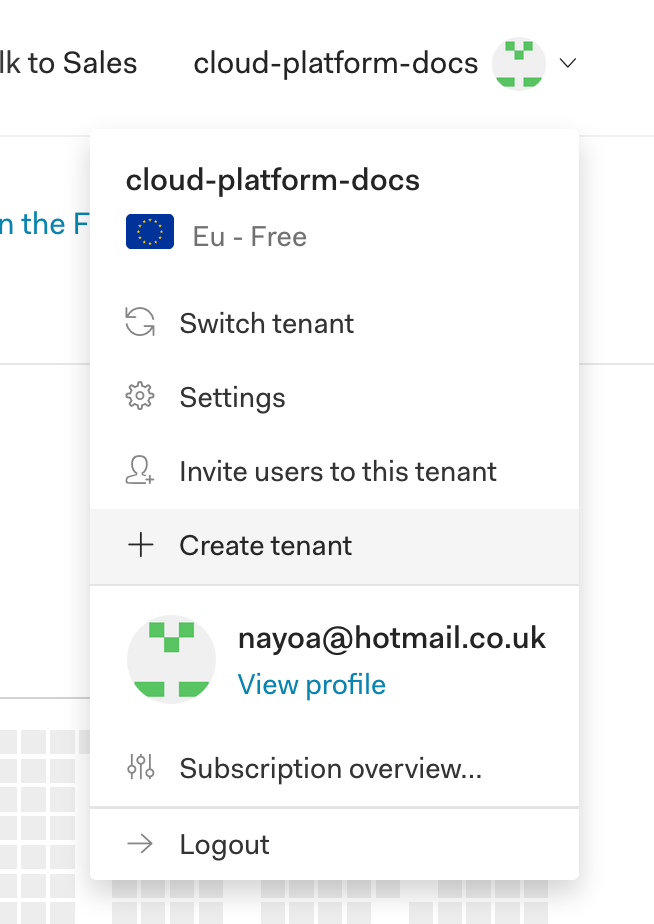
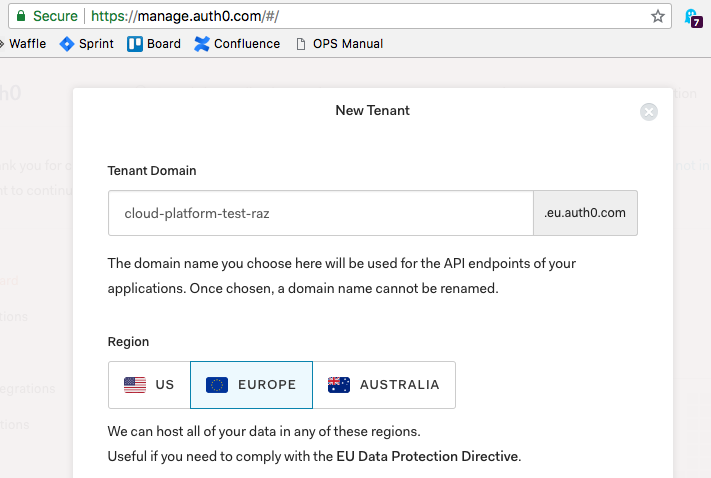
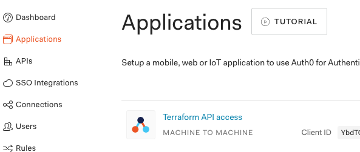

# How to create a cluster.

## Prerequisites

```

$ brew install kubernetes-cli
$ brew install kubernetes-helm
$ brew install terraform

```


### Create Auth0 for new cluster.

1. Use your Github credentials to log into https://manage.auth0.com. Once you have logged in create a new tenant.

   


1. Enter a tenant domain name and select the EU Region.

   

1. Create a single ["Machine to Machine"](https://auth0.com/docs/applications/machine-to-machine) Application. This application will allow terraform API access to create resources in Auth0. Select Management API with all scopes. Take note of the app's "Client ID & Secret" for use with terraform later.
  

1. Create An **org-owned** [Github Oauth app](https://auth0.com/docs/connections/social/github), callback URL pointing to https://tenant-name.eu.auth0.com/login/callback

1. Create a "Social Connection" of type Github, using the Github oauth credentials and put permissions read:org and read:user privs.

1. [terraform steps.] [terraform creates kuberos app- callback] Terraform and the [Yieldr Auth0 provider](https://github.com/yieldr/terraform-provider-auth0) create kuberos, Edit terraform.tfvars, add tenant domain, id and secret from the M2M App created above, these will be used by `provider "auth0" {}` in main.tf  `terraform plan && terraform apply`

Steps:
1. Create a k8s cluster, see [../kops/](../kops/) folder for existing ones
   1. Copy the live-0 yaml, replace the oidcClientID and oidcIssueURL with the Kuberos application oidcClientID, oidcIssueURL with the tenant domain.
   1. Unprotect the master branch by going to settings > branches > ??
   1. Commit to master and check pipeline output in [CodePipeline](https://eu-west-1.console.aws.amazon.com/codepipeline/home?region=eu-west-1#/view/cluster-creation-pipeline)
   1. Once the cluster been built. you will need to configure your aws profile to use Platform-Integrations account.
   1. Export Kops state store
      
      ```
        export KOPS_STATE_STORE=s3://moj-cloud-platforms-kops-state-store
      ```
   1. Download Cluster Spec from S3 and configure kubectl for use
   
      ```
        kops export kubecfg <clustername>
      ```

   ### Install Cluster Components

   Using the kubernetes investigations repo, we will install all the cluster components.

1. Install Helm
    ```
      $ kubectl apply -f /cluster-components/helm/rbac-config.yml
      serviceaccount "tiller" created
      clusterrolebinding.rbac.authorization.k8s.io "tiller" created
      $ helm init --tiller-namespace kube-system --service-account tiller
      ```
1. Install external-dns, see [/cluster-components/external-dns](/cluster-components/external-dns) for existing ones, copy live-0, edit domainFilters
    ```
      $ helm install -n external-dns --namespace kube-system stable/external-dns -f /cluster-components/external-dns/cloud-platform-test-raz-helm-values.yaml
      $ kubectl --namespace=kube-system get pods -l "app=external-dns,release=external-dns"
      NAME                            READY     STATUS    RESTARTS   AGE
      external-dns-798cc84bdc-h4zst   1/1       Running   0          24s
    ```
1. Install ingress, see [/cluster-components/nginx-ingress](/cluster-components/nginx-ingress) for existing ones, copy live-0, edit hostname and aws-load-balancer-ssl-cert (this was generated earlier by Terraform in the pipeline triggered by the commit to master, see [/terraform/modules/cluster_ssl/](../terraform/modules/cluster_ssl/))
    ```
      $ helm install -n nginx-ingress --namespace ingress-controller stable/nginx-ingress -f /cluster-components/nginx-ingress/
      $ kubectl --namespace ingress-controller get services -o wide -w nginx-ingress-controller
      NAME                       TYPE           CLUSTER-IP      EXTERNAL-IP                                                               PORT(S)                      AGE       SELECTOR
      nginx-ingress-controller   LoadBalancer   100.68.102.11   a968b3bdf851c11e886e00a458ee6675-1910441520.eu-west-1.elb.amazonaws.com   80:30967/TCP,443:31280/TCP   33s       app=nginx-ingress,component=controller,release=nginx-ingress
    ```
1. Edit config for Kuberos, see [/cluster-components/kuberos](/cluster-components/kuberos) for existing ones
    1. Copy the live-0 folder with the new name, `cd` to it
    1. Change OIDC_ISSUER_URL, OIDC_CLIENT_ID, certificate-authority-data, server, name, host in kuberos.yaml
    1. Change secret in secret.yaml (this one needs to be base64 encoded)
    1. `kubectl config current-context` - be sure you're in the one just created
    1. Install Kuberos
        ```
          $ kubectl apply -f .
          configmap "kuberos-oidc-env" created
          configmap "templates" created
          ingress.extensions "kuberos" created
          service "kuberos" created
          deployment.extensions "kuberos" created
          secret "kuberos-oidc" created

          $ kubectl -n default get pods
          NAME                      READY     STATUS    RESTARTS   AGE
          kuberos-b7d5f755d-l8jb5   1/1       Running   0          1m
        ```
1. Add WebOps group as admins

    ```
     $ kubectl apply -f ../../../cluster-config/rbac/webops-cluster-admin.yml
     clusterrolebinding.rbac.authorization.k8s.io "webops-cluster-admin" created

    ```

   ### Recovering Environments

1. All the environments created within a cluster is on github, so any trigger of the pipeline will create all environments under namespaces/$cluster_name. You can recover the namespaces and service account via triggering the pipeline.


