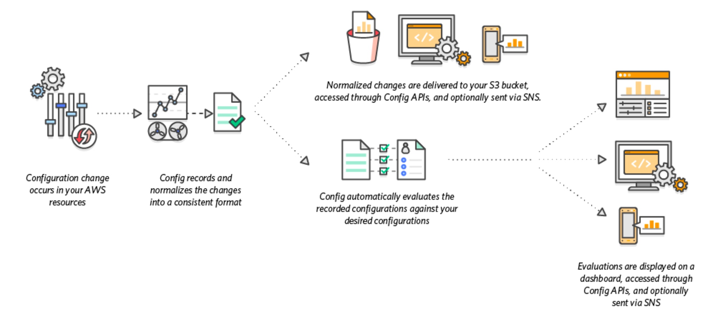
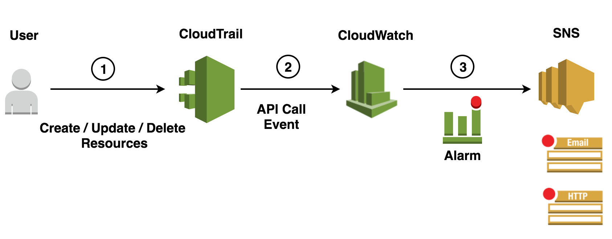

# AWS Config, Cloudtrail
This section covers the setup of AWS Config, Cloudtrail Services and the S3 buckets to store the logs.

* [AWS Config](#AWS-Config)
* [AWS Cloudtrail](#AWS-Cloudtrail)
* [How to Deploy the Templates](#How-to-Deploy-the-templates)
* [Service Control Policy to deny changes to CloudTrail](#Service-Control-Policy-to-deny-changes-to-CloudTrail)


# AWS Config
AWS Config is a service that enables to assess, audit, and evaluate the configurations of the AWS resources. Config continuously monitors and records the AWS resource configurations and allows to automate the evaluation of recorded configurations against desired configurations.



## Config Rules
The config rules that are implemented through the template are -

* AMI Compliance Rules
* Check whether Cloudtrail is enabled
* Check whether Cloudwatch Logs are encrypted
* Monitor for Unrestricted SSH Access
* Monitor for User-Defined Unrestricted Ports
* Check whether Root Account is MFA enabled
* Check whether EC2 instances are tagged
* Check whether S3 buckets have server side encryption enabled
* Check whether Public S3 buckets are write prohibhited
* Check whether Public S3 buckets are read prohibhited


# AWS Cloudtrail
CloudTrail is enabled by default for the AWS account. It includes activity made through the AWS Management Console, AWS Command Line Interface, and AWS SDKs and APIs.
A trail can be created for the record of events in the AWS account. It enables Cloudtrail to deliver log files to an Amazon S3 bucket.
By default, when the trail is created in the console, the trail applies to all AWS Regions. The trail logs events from all Regions in the AWS partition and delivers the log files to the Amazon S3 bucket that is specified. Additionally, other AWS services can be configured to analyze further and act upon the event data collected in CloudTrail logs.

## Buckets for Cloudtrail
Creates S3 Buckets for Cloudtrail, Config and Access Logs. The Cloudtrail S3 bucket can receive CloudTrail log files from multiple AWS accounts. The Cloudtrail in the multiple AWS accounts can be configured to deliver log files from these accounts to that S3 bucket.
The name of the S3 bucket has to be supplied when the Cloudtrail is enabled in the accounts.

## Cloudtrail API monitoring and Alarms
Amazon CloudWatch is integrated with AWS CloudTrail, a service that provides a record of actions taken by a user, role, or an AWS service in CloudWatch. CloudTrail captures API calls made by or on behalf of the AWS account. The calls captured include calls from the CloudWatch console and code calls to the CloudWatch API operations. If the trail is created, it can enable continuous delivery of CloudTrail events to an Amazon S3 bucket, including events for CloudWatch. Using the information collected by CloudTrail, we can determine the request that was made to CloudWatch, the IP address from which the request was made, who made the request, when it was made,and additional details.

The template defines metric filters that monitor create, delete, and update operations for the following resource types:
* IAM policies
* Network ACLs
* Security groups
* IAM Root Activity
* IAM Create Access Key
* Cloudtrail
* Internet and Customer gateways
* VPCs
* EC2 instances
* EC2 Large instances
* Console Sign-in Failures
* Unauthorized attempts
* Console Sign-in or API activity without MFA



When an API call occurs in the account, a metric filter monitors that API call. If the API call exceeds the thresholds that was specified,this triggers the alarm and CloudWatch sends a notification to the SNS Topic. The team that implements the stack is responsible to chose the suitable means to receive the alerts.

By default, most of the filters in the template trigger an alarm when a monitored event occurs within a five-minute period. The alarm thresholds can be modified for specific requirements. For example, three events can be monitored in a ten-minute period. To make the changes, the template has to be edited or, after uploading the template, the thresholds are specified in the CloudWatch console. Because CloudTrail typically delivers log files every five minutes, specify alarm periods of five minutes or more.


# How to Deploy the templates
Deploy the templates under aws-config-cloudtrail-logging into the aws accounts through Cloudformation as individual stacks.

Step 1 - Run the [aws-cloudtrail-create-bucket.yaml](#aws-cloudtrail-create-bucket.yaml) template to create the below S3 Buckets
- Bucket for Cloudtrail logs
- Bucket for storing Config logs
- Bucket for Access Logs

Step 2 - Run the [aws-config-enable-rules.yaml](#aws-config-enable-rules.yaml) template to enable config service and create config rules
Use the bucket created in Step 1 for Config logs in the parameter pConfigBucket

Step 3 - Run the [aws-cloudtrail-log-monitoring.yaml](#aws-cloudtrail-log-monitoring.yaml) template to implement cloudtrail log monitoring metrics and alarms
Use the bucket created in Step 1 for the Cloudtrail logs in the parameter pCloudtrailBucket

## aws-cloudtrail-create-bucket.yaml
This template is run on the account where the cloudtrail needs to be stored for a longer period.
```bash
# parameters
AWS_PROFILE={aws_profile_name}
CLOUDTRAIL_BUCKETNAME={agency}-cloudtraillogs
CONFIG_BUCKETNAME={agency}-configlogs
ACCESSLOGS_BUCKETNAME={agency}-accesslogs
ACCOUNT_EMAIL={account_email}
AGENCY_NAME={agency_name}

export AWS_PROFILE
export CLOUDTRAIL_BUCKETNAME
export CONFIG_BUCKETNAME
export ACCESSLOGS_BUCKETNAME
export ACCOUNT_EMAIL
export AGENCY_NAME

# validate the template
aws cloudformation validate-template --template-body file://aws-cloudtrail-create-bucket.yaml --profile $AWS_PROFILE

# deploy the template
aws cloudformation create-stack --stack-name aws-cloudtrail-create-bucket --template-body file://aws-cloudtrail-create-bucket.yaml --parameters 
ParameterKey=CloudTrailBucketName,ParameterValue=$CLOUDTRAIL_BUCKETNAME ParameterKey=ConfigBucketName,ParameterValue=$CONFIG_BUCKETNAME ParameterKey=AccessLogsBucketName,ParameterValue=$ACCESSLOGS_BUCKETNAME --tags Key=Owner,Value=$ACCOUNT_EMAIL Key=AgencyName,Value=$AGENCY_NAME Key=ApplicationID,Value=aws-cloudtrail Key=Environment,Value=Production --capabilities CAPABILITY_NAMED_IAM --profile $AWS_PROFILE

```

## aws-config-enable-rules.yaml
```bash
# parameters
AWS_PROFILE={aws_profile_name}
CONFIG_BUCKETNAME={config-bucket-name-from-create-bucket-template}
EXISTING_SNS_TOPIC_ARN={existing-sns-topic-arn}
BLOCKED_PORT1={port_to_be_blocked}
BLOCKED_PORT2={port_to_be_blocked}
BLOCKED_PORT3={port_to_be_blocked}
BLOCKED_PORT4={port_to_be_blocked}
BLOCKED_PORT5={port_to_be_blocked}
ACCOUNT_EMAIL={account_email}
AGENCY_NAME={agency_name}

export AWS_PROFILE
export CONFIG_BUCKETNAME
export EXISTING_SNS_TOPIC_ARN
export BLOCKED_PORT1
export BLOCKED_PORT2
export BLOCKED_PORT3
export BLOCKED_PORT4
export BLOCKED_PORT5
export ACCOUNT_EMAIL
export AGENCY_NAME

# validate the template
aws cloudformation validate-template --template-body file://aws-config-enable-rules.yaml --profile $AWS_PROFILE

# deploy the template
aws cloudformation create-stack --stack-name aws-enable-config-service --template-body file://aws-config-enable-rules.yaml  --parameters ParameterKey=pDeliveryFrequency,ParameterValue=Three_Hours ParameterKey=pConfigResourceTypes,ParameterValue=AllSupported ParameterKey=pConfigBucket,ParameterValue=$CONFIG_BUCKETNAME  ParameterKey=pCreateS3Bucket,ParameterValue=false ParameterKey=pS3Prefix,ParameterValue= ParameterKey=pCreateSnsTopic,ParameterValue=false ParameterKey=pSnsNotifyEmail,ParameterValue= ParameterKey=pExistingSnsTopic,ParameterValue=$EXISTING_SNS_TOPIC_ARN ParameterKey=pRuleUnrestrictedSsh,ParameterValue=true ParameterKey=pRuleUnrestrictedPorts,ParameterValue=true  ParameterKey=pRuleUnrestictedPortsBlockedPort1,ParameterValue=$BLOCKED_PORT1 ParameterKey=pRuleUnrestictedPortsBlockedPort2,ParameterValue=$BLOCKED_PORT2 ParameterKey=pRuleUnrestictedPortsBlockedPort3,ParameterValue=$BLOCKED_PORT3 ParameterKey=pRuleUnrestictedPortsBlockedPort4,ParameterValue=$BLOCKED_PORT4  ParameterKey=pRuleUnrestictedPortsBlockedPort5,ParameterValue=$BLOCKED_PORT5 ParameterKey=pRuleAmiCompliance,ParameterValue=false  ParameterKey=pRuleAmiComplianceAmiList,ParameterValue=  ParameterKey=pRuleCloudtrailValidation,ParameterValue=true ParameterKey=pRuleRootMfa,ParameterValue=true  ParameterKey=pRuleRequiredTag,ParameterValue=true ParameterKey=pRuleRequiredTagToCheck,ParameterValue=Owner  --tags Key=Owner,Value=$ACCOUNT_EMAIL Key=AgencyName,Value=$AGENCY_NAME Key=ApplicationID,Value=aws-config Key=Environment,Value=Production  --capabilities CAPABILITY_NAMED_IAM  --profile $AWS_PROFILE
```

## aws-cloudtrail-log-monitoring.yaml
```bash
# parameters
AWS_PROFILE={aws_profile_name}
CLOUDTRAIL_BUCKETNAME={cloudtrail-bucket-name-output-from-aws-cloudtrail-create-bucket.yaml}
EXISTING_SNS_TOPIC_ARN={existing-sns-topic-arn}
ACCOUNT_EMAIL={account_email}
AGENCY_NAME={agency_name}

export AWS_PROFILE
export EXISTING_SNS_TOPIC_ARN
export ACCOUNT_EMAIL
export AGENCY_NAME

# validate the template
aws cloudformation validate-template --template-body file://aws-cloudtrail-log-monitoring.yaml --profile $AWS_PROFILE

# deploy the template
aws cloudformation create-stack --stack-name aws-cloudtrail-log-monitoring --template-body file://aws-cloudtrail-log-monitoring.yaml --parameters ParameterKey=pCloudtrailBucket,ParameterValue=$CLOUDTRAIL_BUCKETNAME ParameterKey=pCreateSnsTopic,ParameterValue=false ParameterKey=pNotifyEmail,ParameterValue= ParameterKey=pExistingSnsTopic,ParameterValue=$EXISTING_SNS_TOPIC_ARN ParameterKey=pServiceName,ParameterValue=Cloudtrail ParameterKey=pSupportsGlacier,ParameterValue=true --tags Key=Owner,Value=$ACCOUNT_EMAIL Key=AgencyName,Value=$AGENCY_NAME Key=ApplicationID,Value=aws-cloudtrail Key=Environment,Value=Production --capabilities CAPABILITY_NAMED_IAM --profile $AWS_PROFILE
```


# Service Control Policy to deny changes to CloudTrail

## Background 
To ensure that we always have CloudTrail logs enabled in all the AWS accounts an AWS Organization SCP deny rule needs to be created. This will ensure that CloudTrail cannot be disabled or deleted once enabled.

The policy is applied at the Organizational Unit level in the Master AWS account, where the AWS Organisations service is used to create the AWS accounts and therefore is a manual step.

The below policy needs to be added and attached at the Organizational Unit level.

```
{
  "Version": "2012-10-17",
   "Statement": [  
        {
            "Sid": "BlockCloudTrailDeleteStopUpdateActions",
            "Effect": "Deny",
            "Action": [
                "cloudtrail:DeleteTrail",
                "cloudtrail:StopLogging",
                "cloudtrail:UpdateTrail"
            ],
            "Resource": "*"
        }  
    ]
}
```
