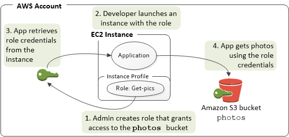

# AWS IAM User Roles And Groups
This section explains how to create different IAM User Roles, Groups, implement Region Restrictions, enforce MFA from CLI and Console, EC2 instance profiles, non-admin IAM user self-service policy, Explicit Deny Policy

* [IAM Policy to Restrict Regions and Enforce MFA](#iam-policy-to-restrict-regions-and-enforce-mfa)
* [User Profiles](#user-profiles)
* [EC2 Instance Profiles](#ec2-instance-profiles)
* [Switching to an IAM Role](#Switching-to-an-IAM-Role)
* [Service Control Policy to Limit API access](#service-control-policy-to-limit-api-access-for-users-and-services-to-eu-region-only)
* [Deny Policy for Non-Admin IAM Users](#deny-policy)
* [User Self Service policy](#non-admin-user-self-service-policy)
* [How To Deploy](#how-to-deploy)
* [Further Reading](#Further-Reading)


# IAM Policy to Restrict Regions and Enforce MFA

## Background
We do not wish to use non-EU AWS regions for strategic compliance and performance reasons. We would need a policy that no users in the AWS account can create resources outside of AWS EU regions.
 
AWS has few global resources like IAM, Cloudfront, ACM which work from us-east-1 region as root. Hence the us-east-1 region cannot be excluded for managing global services.

Also the Region restriction policy cannot be implemeted at Organisational Unit in the master AWS Account. Currently it has to be restricted through the user IAM policy by adding the condition - aws:RequestedRegion.

Reference -
* [AWS Global Condition Context Keys](https://docs.aws.amazon.com/IAM/latest/UserGuide/reference_policies_condition-keys.html) - aws:RequestedRegion
* Easier way to control access to [AWS regions using IAM policies](https://aws.amazon.com/blogs/security/easier-way-to-control-access-to-aws-regions-using-iam-policies/)

The non-admin user IAM Policy with MFA and Region restriction looks like -
```
{
    "Version": "2012-10-17",
    "Statement": [
        {
            "Sid": "UserDeveloperPolicy",
            "Effect": "Allow",
            "Action": [
                "autoscaling:*",
                "cloudformation:*",
                "cloudwatch:*",
                "codebuild:*",
                "deploy",
                "dynamodb:*",
                "ec2:*",
                "ecs:*",
                "elasticbeanstalk:*",
                "elasticloadbalancing:*",
                "kms:*",
                "lambda:*",
                "logs:*",
                "rds:*",
                "route53:*",
                "s3:*",
                "sns:*"
            ],
            "Resource": "*",
            "Condition": {
                "StringEquals": {
                    "aws:RequestedRegion": ["eu-west-1", "eu-west-2", "eu-west-3", "us-east-1"]
                }
            }
        }
    ]
}
```

## Description
The templates are standalone and do not depend on other templates for deployment. The parameter for the template is the Cross Account Id from which the users need to switch to the role and gain the correct permissions. For further details on how the IAM roles work, please refer the [link](https://aws.amazon.com/blogs/security/how-to-enable-cross-account-access-to-the-aws-management-console/)

* [User Profiles](#User-Profiles)
* [EC2 Instance Profiles](#EC2-Instance-Profiles)
* [Switching to an IAM Role](#Switching-to-an-IAM-Role)

### User Profiles
The templates aws-iam-adminandgroups.yaml, aws-iam-adminandroles.yaml implement assume role permissionns for a group of aws accounts. The roles and groups created by the templates are -
  - IAMAdminRole
  - BillingAdminRole
  - InfraAdminRole
  - NetworkAdminRole
  - UserDeveloperRole
  - UserDBARole
  - UserTesterRole
  - AuditAdminRole
  - UserLiveSupportRole
  - user-aws-support-managed-policy - The policy provides access for DBA, Tester and Dev users to AWS support
  - user-dba-managed-policy - The policy provides access to DBA users to start/stop DB instance, Create/Reboot/Delete Snapshot
  - user-parameter-store-managed-policy - The policy provides access for DBA, Tester and Dev user to manage parameters in parameter store
  - LZReadOnlyAccess - The policy that provides read only access to DBA, Tester, Dev & Live Support users
  - user-malicious-activity-deny-policy - The policy restricts the user roles, DBA, Test, Dev users from creating/modifying ec2, cloudtrail, iam, billing, kms resources

To know more about assume roles, please refer to the [link](https://docs.aws.amazon.com/IAM/latest/UserGuide/tutorial_cross-account-with-roles.html)

The template aws-iam-userpolicy-cli-mfa.yaml creates a user group, user role and attaches user self service iam policy to manage their MFA devices. The users can authenticate the mfa from cli when they assume the DevRole. The user policy consists of region restriction and is attached to the user role. New users will be added to the group and the user-self-service-policy will be inherited. They can perform IAM settings & MFA device updates without having to assume the role.

### EC2 Instance Profiles
The template aws-iam-instanceprofiles.yaml has a list of IAM roles for the instances to use
  - rSysAdminRole-inst
  - rIAMAdminRole-inst
  - rInstanceOpsRole-inst
  - rInstanceOpsProfile-inst
  - rReadOnlyAdminRole-inst



To know more about how roles work for EC2 Instances, please refer to this [link](https://docs.aws.amazon.com/IAM/latest/UserGuide/id_roles_use_switch-role-ec2.html)

### Switching to an IAM Role
When a role is created for cross-account access, it establishes trust from the account that owns the role and the resources (trusting account) to the account that contains the users (trusted account). To do this, the trusted account number is specified as the Principal in the role's trust policy. That allows potentially any user in the trusted account to assume the role. To complete the configuration, the administrator of the trusted account must give specific groups or users in that account permission to switch to the role.

To grant a user permission to switch to a role, a new policy for the user is created or an existing policy ca be edited to add the required elements. The user uses the AWS account ID number or account alias that contains the role and the role name. The user then goes to the Switch Role page and adds the details manually. For details on how a user switches roles, please refer below links

* Switching to an IAM Role [AWS CLI](https://docs.aws.amazon.com/IAM/latest/UserGuide/id_roles_use_switch-role-cli.html)
* Switching to a Role [Console](https://docs.aws.amazon.com/IAM/latest/UserGuide/id_roles_use_switch-role-console.html)
* To run AWS commands from [CLI using MFA authentication](https://aws.amazon.com/premiumsupport/knowledge-center/authenticate-mfa-cli/)
Please refer to the steps in the link to generate the temporary session tokens, based on the MFA code. The temporary session token can be used as the 2FA


# Service Control Policy to Limit API access for users and services to EU-Region-only
Conditions are now supported in the Organisational Service Control Policy (SCP), the below policy to be applied at the Organisational Unit in the master AWS Account

```
{
    "Version": "2012-10-17",
    "Statement": [
        {
            "Sid": "DenyAllOutsideEU",
            "Effect": "Deny",
            "Action": "*",
            "Resource": "*",
            "Condition": {
                "StringNotEquals": {
                    "aws:RequestedRegion": [
                        "eu-west-1",
                        "eu-west-2",
                        "eu-west-3",
                        "us-east-1"
                    ]
                }
            }
        }
    ]
}
```


# Other IAM Policies for Non-Admin IAM Users

## Deny policy
The Deny policy for the non-admin users in the account is below in the json format,

```
{
"Version": "2012-10-17",
"Statement": [
    {
      "Sid": "user-malicious-activity-deny-policy",
      "Effect": "Deny",
      "Action": [
        "ec2:AcceptVpcPeeringConnection",
        "ec2:AssociateRouteTable",
        "ec2:AttachInternetGateway",
        "ec2:AttachVpnGateway",
        "ec2:AuthorizeSecurityGroupEgress",
        "ec2:AuthorizeSecurityGroupIngress",
        "ec2:CreateCustomerGateway",
        "ec2:CreateDhcpOptions",
        "ec2:CreateNatGateway",
        "ec2:CreateNetworkAcl",
        "ec2:CreateNetworkAclEntry",
        "ec2:CreateRoute",
        "ec2:CreateRouteTable",
        "ec2:CreateVpc",
        "ec2:CreateVpcPeeringConnection",
        "ec2:CreateVpnConnection",
        "ec2:CreateVpnConnectionRoute",
        "ec2:CreateVpnGateway",
        "ec2:DeleteCustomerGateway",
        "ec2:DeleteDhcpOptions",
        "ec2:DeleteInternetGateway",
        "ec2:DeleteNatGateway",
        "ec2:DeleteNetworkAcl",
        "ec2:DeleteNetworkAclEntry",
        "ec2:DeleteRoute",
        "ec2:DeleteRouteTable",
        "ec2:DeleteSubnet",
        "ec2:DeleteVpc",
        "ec2:DeleteVpcPeeringConnection",
        "ec2:DeleteVpnConnection",
        "ec2:DeleteVpnConnectionRoute",
        "ec2:DeleteVpnGateway",
        "ec2:DisassociateAddress",
        "ec2:DisassociateRouteTable",
        "ec2:ReplaceNetworkAclAssociation",
        "ec2:ReplaceNetworkAclEntry",
        "ec2:TerminateInstances",
        "cloudtrail:DeleteTrail",
        "cloudtrail:StopLogging",
        "cloudtrail:UpdateTrail",
        "iam:AddRoleToInstanceProfile",
        "iam:AddUserToGroup",
        "iam:AttachGroupPolicy",
        "iam:AttachRolePolicy",
        "iam:AttachUserPolicy",
        "iam:DeleteRole",
        "iam:DeleteRolePolicy",
        "iam:DeleteUserPolicy",
        "iam:PutGroupPolicy",
        "iam:PutRolePolicy",
        "iam:PutUserPolicy",
        "iam:UpdateAssumeRolePolicy",
        "aws-portal:ModifyAccount",
        "aws-portal:ModifyBilling",
        "aws-portal:ModifyPaymentMethods",
        "kms:DeleteAlias",
        "kms:ScheduleKeyDeletion",
        "kms:CreateGrant",
        "kms:PutKeyPolicy"
      ],
      "Resource": "*"
    }
  ]
}
```

## Non-Admin User Self Service policy
This is an IAM policy that allows IAM non-admin users to self-manage their MFA device.

```
 {
  "Version": "2012-10-17",
  "Statement": [
    {
      "Sid": "AllowAllUsersToListAccounts",
      "Effect": "Allow",
      "Action": [
        "iam:ListAccountAliases",
        "iam:ListUsers",
        "iam:GetAccountPasswordPolicy",
        "iam:GetAccountSummary"
      ],
      "Resource": "*"
    },
    {
      "Sid": "AllowIndividualUserToSeeAndManageOnlyTheirOwnAccountInformation",
      "Effect": "Allow",
      "Action": [
        "iam:ChangePassword",
        "iam:CreateAccessKey",
        "iam:CreateLoginProfile",
        "iam:DeleteAccessKey",
        "iam:DeleteLoginProfile",
        "iam:GetLoginProfile",
        "iam:ListAccessKeys",
        "iam:UpdateAccessKey",
        "iam:UpdateLoginProfile",
        "iam:ListSigningCertificates",
        "iam:DeleteSigningCertificate",
        "iam:UpdateSigningCertificate",
        "iam:UploadSigningCertificate",
        "iam:ListSSHPublicKeys",
        "iam:GetSSHPublicKey",
        "iam:DeleteSSHPublicKey",
        "iam:UpdateSSHPublicKey",
        "iam:UploadSSHPublicKey"
      ],
      "Resource": "arn:aws:iam::*:user/${aws:username}"
    },
    {
      "Sid": "AllowIndividualUserToListOnlyTheirOwnMFA",
      "Effect": "Allow",
      "Action": [
        "iam:ListVirtualMFADevices",
        "iam:ListMFADevices"
      ],
      "Resource": [
        "arn:aws:iam::*:mfa/*",
        "arn:aws:iam::*:user/${aws:username}"
      ]
    },
    {
      "Sid": "AllowIndividualUserToManageTheirOwnMFA",
      "Effect": "Allow",
      "Action": [
        "iam:CreateVirtualMFADevice",
        "iam:DeleteVirtualMFADevice",
        "iam:EnableMFADevice",
        "iam:ResyncMFADevice"
      ],
      "Resource": [
        "arn:aws:iam::*:mfa/${aws:username}",
        "arn:aws:iam::*:user/${aws:username}"
      ]
    },
    {
      "Sid": "AllowIndividualUserToDeactivateOnlyTheirOwnMFAOnlyWhenUsingMFA",
      "Effect": "Allow",
      "Action": [
        "iam:DeactivateMFADevice"
      ],
      "Resource": [
        "arn:aws:iam::*:mfa/${aws:username}",
        "arn:aws:iam::*:user/${aws:username}"
      ],
      "Condition": {
        "Bool": {
            "aws:MultiFactorAuthPresent": "true"
        }
      }
    }
  ]
}
```

Reference - https://docs.aws.amazon.com/IAM/latest/UserGuide/reference_policies_examples_iam_mfa-selfmanage.html


# How to Deploy

* [Create Admin Groups](#aws-iam-adminandgroups.yaml)
* [Create Admin Roles](#aws-iam-adminandroles.yaml)
* [Create Instace Profiles](#aws-iam-instanceprofiles.yaml)
* [Create User Policy for enforcing CLI MFA](#aws-iam-userpolicy-cli-mfa.yaml)

## aws-iam-adminandgroups.yaml
Parameters -
No Parameters needed to deploy the template

```
AWS_PROFILE={aws_profile}

# Validate template
aws cloudformation validate-template --template-body file://aws-iam-adminandgroups.yaml --profile $AWS_PROFILE

# Deploy the template
aws cloudformation create-stack --template-body file://aws-iam-adminandgroups.yaml --stack-name aws-iam-adminandgroups --tags Key=Owner,Value={team-email} Key=AgencyName,Value={agency-name} Key=ApplicationID,Value=aws-iam Key=Environment,Value=Production --capabilities CAPABILITY_NAMED_IAM --profile $AWS_PROFILE
```

## aws-iam-adminandroles.yaml
Parameters -
CrossAccountId - The cross account ID of the AWS account from which the users need to switch the roles

```
AWS_PROFILE={aws_profile}

# Validate template
aws cloudformation validate-template --template-body file://aws-iam-adminandroles.yaml --profile $AWS_PROFILE

# Deploy the template
aws cloudformation create-stack --template-body file://aws-iam-adminandroles.yaml --stack-name aws-iam-adminandroles --parameters ParameterKey=CrossAccountId,ParameterValue={cross-account-id} --tags Key=Owner,Value={team-email} Key=AgencyName,Value={agency-name} Key=ApplicationID,Value=aws-iam Key=Environment,Value=Production --capabilities CAPABILITY_NAMED_IAM --profile $AWS_PROFILE
```

## aws-iam-instanceprofiles.yaml
Parameters -
No Parameters needed to deploy the template

```
AWS_PROFILE={aws_profile}

# Validate template
aws cloudformation validate-template --template-body file://aws-iam-instanceprofiles.yaml --profile $AWS_PROFILE

# Deploy the template
aws cloudformation create-stack --template-body file://aws-iam-instanceprofiles.yaml --stack-name aws-iam-instanceprofiles --tags Key=Owner,Value={team-email} Key=AgencyName,Value={agency-name} Key=ApplicationID,Value=aws-iam Key=Environment,Value=Production --capabilities CAPABILITY_NAMED_IAM --profile $AWS_PROFILE
```

## aws-iam-userpolicy-cli-mfa.yaml
Parameters -
No Parameters needed to deploy the template

```
GIT_DIR={git_dir}
AWS_PROFILE={aws_profile}

# Validate template
aws cloudformation validate-template --template-body file://aws-iam-userpolicy-cli-mfa.yaml --profile $AWS_PROFILE

# Deploy the template
aws cloudformation create-stack --template-body file://aws-iam-userpolicy-cli-mfa.yaml --stack-name aws-iam-userpolicy-cli-mfa --tags Key=Owner,Value={team-email} Key=AgencyName,Value={agency-name} Key=ApplicationID,Value=aws-iam Key=Environment,Value=Production --capabilities CAPABILITY_NAMED_IAM --profile $AWS_PROFILE
```

# Further Reading
* https://docs.aws.amazon.com/IAM/latest/UserGuide/id_roles_common-scenarios_aws-accounts.html
* https://docs.aws.amazon.com/IAM/latest/UserGuide/tutorial_cross-account-with-roles.html