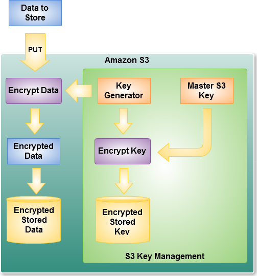

# S3 Enable Encryption And Public Access Block

This section explains how to apply S3 default Encryption (SSE) and Public Access Block for the S3 buckets

* [S3 Enable Default Encryption](#S3-Default-Encyrption)
* [S3 Public Access Block on Bucket and its objects](#S3-Bucket-Public-Access-Block)
* [How to Deploy the templates](#How-to-Deploy)
* [Further Reading](#Further-Reading)


## S3 Default Encryption
AWS S3 Default Encryption is Server-Side-Encryption (AES-256) which protects data at rest. Amazon S3 Server Side Encryption handles all encryption, decryption, and key management in a totally transparent fashion. Amazon S3 encrypts each object with a unique key. As an additional safeguard, it encrypts the key itself with a master key that it rotates regularly. Amazon S3 server-side encryption uses one of the strongest block ciphers available, 256-bit Advanced Encryption Standard (AES-256), to encrypt the data. The entire encryption, key management, and decryption process is inspected and verified internally on a regular basis as part of AWS existing audit process.

When the object is PUT in the bucket and encryption is requested, (in an HTTP header supplied as part of the PUT), AWS generates a unique key, encrypts the data with the key, and then encrypt the key with a master key. For added protection, keys are stored in hosts that are separate and distinct from those used to store the data. Here’s a diagram of the PUT process for a request that specifies SSE:



Decryption of the encrypted data requires no effort on our part. When the GET request is for an encrypted object, AWS fetches and decrypts the key, and then uses it to decrypt the data. It also has an extra header in the response to the GET to display that the data was stored in encrypted form in Amazon S3.

We can now mandate that all objects in a bucket must be stored in encrypted form by installing a bucket encryption configuration. If an unencrypted object is presented to S3 and the configuration indicates that encryption must be used, the object will be encrypted using encryption option specified for the bucket


## S3 Bucket Public Access Block
AWS S3 buckets are often accidentally left public, resulting in the accidental disclosure of confidential data to everyone. So we want to control the 

Amazon S3 provides Block Public Access settings for buckets and accounts to help to manage public access to Amazon S3 resources. By default, new buckets and objects don't allow public access, but users can modify bucket policies or object permissions to allow public access. Amazon S3 Block Public Access provides settings that override these policies and permissions so that it can limit public access to these resources. With Amazon S3 Block Public Access, account administrators and bucket owners can easily set up centralized controls to limit public access to their Amazon S3 resources that are enforced regardless of how the resources are created.

When Amazon S3 receives a request to access a bucket or an object, it determines whether the bucket or the bucket owner's account has a Block Public Access setting. If there is an existing Block Public Access setting that prohibits the requested access, then Amazon S3 rejects the request. Amazon S3 Block Public Access provides four settings,

    * BlockPublicAcls
    * IgnorePublicAcls
    * BlockPublicPolicy
    * RestrictPublicBuckets

The lambda function s3-bucket-enable-default-encryption.py applies the default S3 encryption Server-Side-Encryption to all the buckets. It checks if the bucket is already encrypted with SSE or AWS-KMS and then skips the bucket. It applies to only those buckets that do not have the encryption set.

Please refer [AWS documentation](https://docs.aws.amazon.com/AmazonS3/latest/dev/access-control-block-public-access.html) for further details


## How to Deploy
This sections explains how to deploy the templates,

* [Parameters](#Parameters)
* [Package and Deploy the Template](#Package-and-Deploy-the-Template)
* [Update the Latest Version of Boto3 to Lambda](#Update-the-Latest-Version-of-Boto3-to-Lambda)
* [Invoke the Lambda](#Invoke-the-Lambda)
* [Disable the Events Rule](#Disable-the-Events-Rule)

### Parameters
* Create SNS Topic (optional)
* Arn of existing SNS topic (optional)
* Apply S3 Public Access Block Permissions (optional)
* Apply S3 Bucket Default Encryption (optional)
* List of S3 Bucket Names to be skip the default encryption check (optional)

### Package and Deploy the Template
```
AWS_PROFILE={aws_profile_name}
S3BUCKETNAME={existing_s3_bucket_in_the_aws_account}
EXISTING_SNS_TOPIC_ARN={existing_sns_topic_arn}
S3_BUCKETS_TO_SKIP_ENCRYPTION={optional-list-of-s3-bucketnames}
ACCOUNT_EMAIL={account_email}
AGENCY_NAME={agency_name}
export AWS_PROFILE
export S3BUCKETNAME
export EXISTING_SNS_TOPIC_ARN
export ACCOUNT_EMAIL
export AGENCY_NAME

# package the template
aws cloudformation package --template-file aws-s3-enable-encryption-and-block-public-access.yaml --s3-bucket $S3BUCKETNAME --output-template-file aws-s3-enable-encryption-and-block-public-access-output.yaml --profile $AWS_PROFILE

# validate the template
aws cloudformation validate-template --template-body file://aws-s3-enable-encryption-and-block-public-access-output.yaml --profile $AWS_PROFILE

# deploy the template
aws cloudformation deploy --template-file aws-s3-enable-encryption-and-block-public-access-output.yaml --stack-name aws-s3-enable-encryption-and-block-public-access --parameter-overrides pCreateSnsTopic=false pExistingSnsTopic=$EXISTING_SNS_TOPIC_ARN pS3PublicAccessBlockPermissions=true pS3BucketEncryption=true pS3BucketsToSkipEncryption=$S3_BUCKETS_TO_SKIP_ENCRYPTION  --tags Owner=$ACCOUNT_EMAIL AgencyName=$AGENCY_NAME ApplicationID=aws-s3 Environment=Production --capabilities CAPABILITY_NAMED_IAM --profile $AWS_PROFILE
```

### Update the Latest Version of Boto3 to Lambda
NOTE - This section is only for the S3 Bucket Public Access Block Lambda Function. Skip this section if you have created only *S3BucketEncryption* lambda function

The following set of commands explains how to update the latest version of Boto3 to the Lambda Function. The API commands put-access-block and get-public-access-block are supported in the boto3 version 1.9.123 and hence the version has to be updated as a Layer to the lambda.
For further reading on updating lamda layer, please refer to the [link](https://docs.aws.amazon.com/lambda/latest/dg/configuration-layers.html#configuration-layers-using)

update the lambda function *S3BucketBlockPublicAccess* with updated version of boto3 layer
```
cd boto3_layer

aws lambda publish-layer-version --layer-name python27-boto3-layer --zip-file fileb://python27-boto3-layer.zip --compatible-runtimes python3.6 --description "This Layer Supports boto3 1.9.123" --profile $AWS_PROFILE | grep "LayerVersionArn"
```

The sample output from above command to publish layer version will be -
```
{
    "Content": {
        "CodeSize": 14909144,
        "CodeSha256": "qUz...",
        "Location": "https://awslambda-eu-west-1-layers.s3.eu-west-1.amazonaws.com/snapshots/account-id/python27-boto3-layer-261cd6fa..."
    },
    "LayerVersionArn": "arn:aws:lambda:eu-west-1:xxxxxxxxxxxx:layer:python27-boto3-layer:1",
    "Version": 1,
    "Description": "",
    "CreatedDate": "2018-12-01T22:07:32.626+0000",
    "LayerArn": "arn:aws:lambda:eu-west-1:xxxxxxxxxxxx:layer:python27-boto3-layer"
}
```

Please note the value of the LayerVersionArn and use it as value for the --layers attribute, 
```
# response from above command will have the arn of the layer which is used in the below command
aws lambda update-function-configuration --function-name S3BucketBlockPublicAccess --layers {layerversionarn-from-above-command} --profile $AWS_PROFILE

Example-
aws lambda update-function-configuration --function-name S3BucketBlockPublicAccess --layers arn:aws:lambda:eu-west-1:{aws-account-id}:layer:python27-boto3-layer:1 --profile $AWS_PROFILE

```

### Invoke the Lambda
The following section explains the commands to invoke the lambda function, in other words, to run the function and apply the changes to the S3 buckets. Currently the lambda functions are scheduled to run as cron job,

* S3BucketBlockPublicAccess runs on 1000 UTC on Wednesday of the week
* S3BucketEncryption runs on 1200 UTC on Wednesday of the week

If you want to invoke them immediately, the following commands can be run from the aws cli -

```
# To invoke the lambda function - S3BucketBlockPublicAccess - Applies Public Access Block permissions to ALL of the existing S3 Buckets
aws lambda invoke --function-name S3BucketBlockPublicAccess --invocation-type RequestResponse --log-type Tail --payload '{}'  outfile   --profile $AWS_PROFILE

# To invoke the lambda function S3BucketEncryption - Applies Default Encryption to ALL of the S3 Buckets
aws lambda invoke --function-name S3BucketEncryption --invocation-type RequestResponse --log-type Tail --payload '{}'  outfile   --profile $AWS_PROFILE

```

### Disable the Events Rule
Disables the specified Events Rule. A disabled rule won't match any events, and won't self-trigger if it has a schedule expression.

```
# Disable Events Rule
aws events disable-rule --name "name-of-the-events-rule" --profile $AWS_PROFILE 
```


## Further Reading
* https://docs.aws.amazon.com/AmazonS3/latest/dev/access-control-block-public-access.html
* https://aws.amazon.com/blogs/aws/amazon-s3-block-public-access-another-layer-of-protection-for-your-accounts-and-buckets/
* https://docs.aws.amazon.com/cli/latest/reference/s3api/put-public-access-block.html
* https://aws.amazon.com/blogs/aws/new-amazon-s3-encryption-security-features/
* https://aws.amazon.com/blogs/aws/new-amazon-s3-server-side-encryption/
* https://docs.aws.amazon.com/lambda/latest/dg/configuration-layers.html
* https://docs.aws.amazon.com/lambda/latest/dg/lambda-python-how-to-create-deployment-package.html#python-package-dependencies