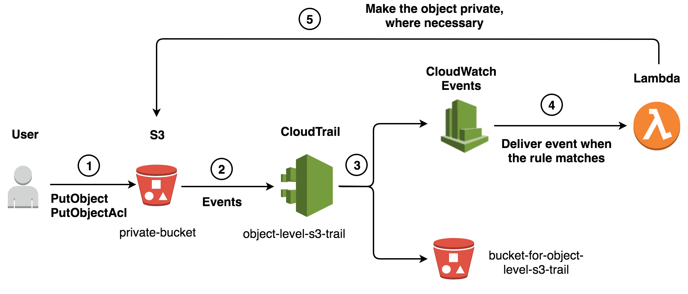

# Auto Remediate Unintended Permissions change on S3 Objects
If the number of objects and users in your AWS account is large, ensuring that you have attached correctly configured ACLs to your objects can be a challenge. Or, what if a user were to call the PutObject with the optional Acl parameter set to public-read, therefore uploading a confidential file as publicly readable? This section explains the solution that uses Amazon CloudWatch Events to detect PutObject and PutObjectAcl API calls in near real time and helps ensure that the objects remain private by making automatic PutObjectAcl calls, when necessary.

* [How to Deploy the templates](#How to Deploy)
* [IAM User Policy to prevent Public Permissions](#IAM User Policy to prevent Public Permissions)


## Background
AWS S3 buckets are often accidentally left public, resulting in the accidental disclosure of confidential data to everyone. Also if the number of objects and users in the AWS account are large, ensuring that the ACLs are correctly configured to the objects can be a challenge. 
We want to ensure that public access to AWS S3 storage is intentional, to avoid the unintended update with public permissions. The template is a *reactive* approach in situations where the change on the ACL is accidental and must be fixed.



References - 
* https://aws.amazon.com/blogs/security/how-to-use-bucket-policies-and-apply-defense-in-depth-to-help-secure-your-amazon-s3-data/
* https://aws.amazon.com/blogs/security/how-to-detect-and-automatically-remediate-unintended-permissions-in-amazon-s3-object-acls-with-cloudwatch-events/


## How to Deploy
Parameters -
Create New Private Bucket or Chose Existing Bucket that needs to be private
Create S3 Bucket for the Object level logging
Create Object level logging for the Private bucket
Create Lambda function to auto remediate object permissions to private
Create Lambda Role permissions
Create SNS Topic with Slack integration or chose existing SNS topic

Mandatory Parameters-
Create New Bucket parameter or Provide Existing bucket name
Provide S3 bucket name for storing object level log
Create SNS Topic parameter, Slack URL, Slack channel name or provide arn of the existing SNS topic

```
# parameters
AWS_PROFILE={aws_profile_name}
export AWS_PROFILE

# validate the template
aws cloudformation validate-template --template-body file://aws-s3-object-auto-remediation.yaml --profile $AWS_PROFILE

# deploy the template
aws cloudformation create-stack --stack-name aws-s3-object-auto-remediate --template-body file://aws-s3-object-auto-remediation.yaml --parameters ParameterKey=pCreateS3PrivateBucket,ParameterValue=false ParameterKey=pS3PrivateBucketName,ParameterValue= ParameterKey=pExistingPrivateBucketName,ParameterValue={existing-s3-bucket-name} ParameterKey=pS3ObjectTrailBucketName,ParameterValue={bucket-to be created-for-the-object-trail} ParameterKey=pObjectCloudTrailName,ParameterValue=s3-object-level-trail ParameterKey=pLambdaFunctionName,ParameterValue=CheckAndCorrectS3ObjectACL ParameterKey=pEventsRuleName,ParameterValue=S3ObjectACLAutoRemediate ParameterKey=pLambdaExecutionRoleName,ParameterValue=AllowLogsAndS3ACL ParameterKey=pCreateSnsTopic,ParameterValue=false ParameterKey=pSlackChannelName,ParameterValue= ParameterKey=pSlackHookUrl,ParameterValue= ParameterKey=pExistingSnsTopic,ParameterValue={existing-sns-topic-arn}  --tags Key=Owner,Value={team-email} Key=AgencyName,Value={agency-name} Key=ApplicationID,Value=aws-s3-object-check Key=Environment,Value=Production --capabilities CAPABILITY_NAMED_IAM --profile $AWS_PROFILE

```


## IAM User Policy to prevent Public Permissions
The *proactive* approach is to restrict user permissions from having the access to update to public permissions. The IAM policy is set with conditions to force the users to put objects with private access.

Note-
The policy can restrict changes to private objects with public permissions only from the AWS CLI. However the Console allows the user to update private object to public permissions. This is due to the way AWS handles the request headers on the console. A work around would be to Block the permissions on the bucket level following the [blog](https://aws.amazon.com/blogs/aws/amazon-s3-block-public-access-another-layer-of-protection-for-your-accounts-and-buckets/)

```
{
    "Version": "2012-10-17",
    "Statement": [
        {
            "Sid": "DenyPublicCannedAcl",
            "Effect": "Deny",
            "Action": [
              "s3:PutBucketAcl",
              "s3:PutObjectAcl",
              "s3:PutObjectVersionAcl"
            ],
            "Resource": [
              "arn:aws:s3:::{bucket_name}",
              "arn:aws:s3:::{bucket_name}/*"
            ],
            "Condition": {
                "StringEquals": {
                    "s3:x-amz-acl": [
                        "public-read",
                        "public-read-write",
                        "authenticated-read"
                    ]
                }
            }
        }
    ]
}

```

Further Reading -
https://docs.aws.amazon.com/AmazonS3/latest/dev/access-control-block-public-access.html
